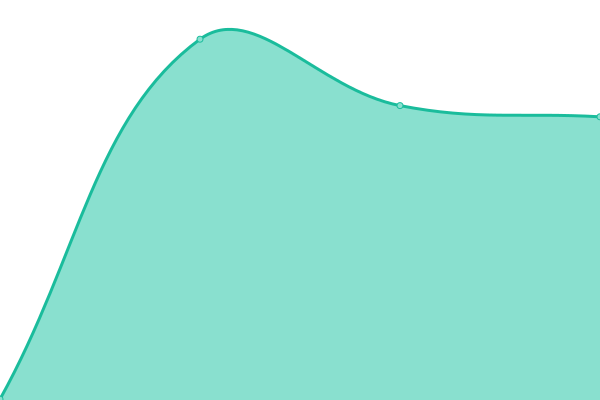

# sHFI Status

<!--start: status pages-->
<!-- This summary is generated by Upptime (https://github.com/upptime/upptime) -->
<!-- Do not edit this manually, your changes will be overwritten -->
<!-- prettier-ignore -->
| URL | Status | History | Response Time | Uptime |
| --- | ------ | ------- | ------------- | ------ |
|  [FriendConnect](http://bcstat.sonyakun.com:50212) | 🟥 Down | [friend-connect.yml](https://github.com/sonyakun/bc-status/commits/HEAD/history/friend-connect.yml) | 

 0ms
     
 | 

<a href="https://sonyakun.github.io/bc-status/history/friend-connect">0.00%</a>
    

<!--end: status pages-->
